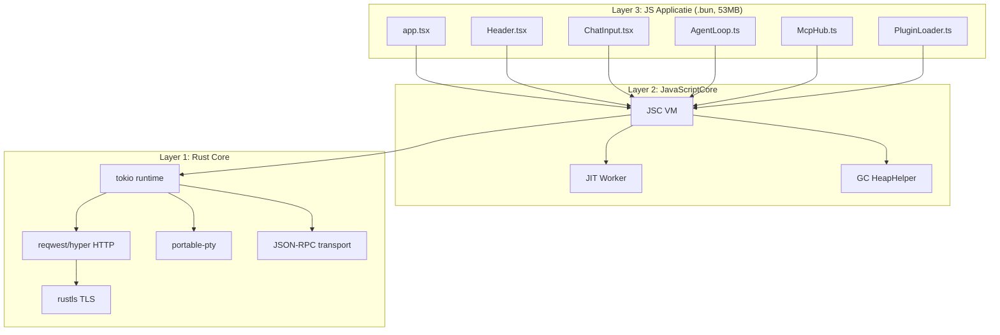
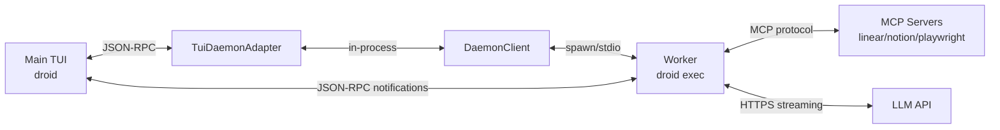
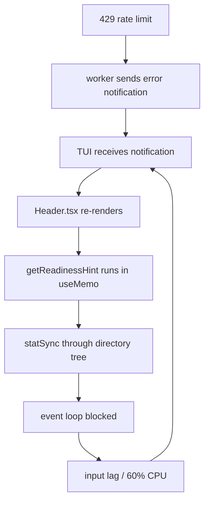
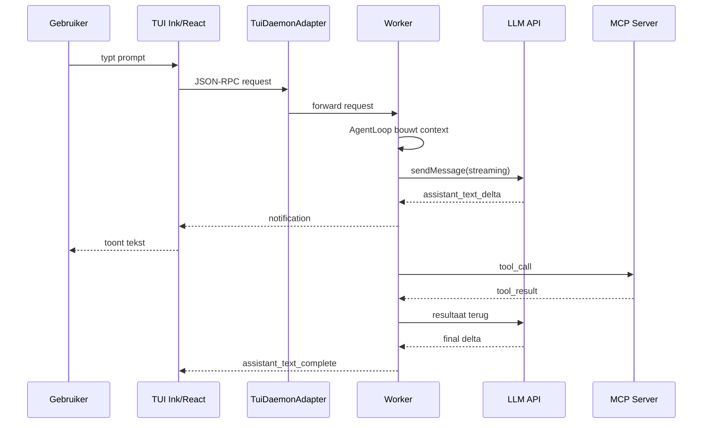

# Droid Architectuur — De Volledige Puzzel (Reverse-Engineered)

> **Doel:** de codebase zo volledig uitleggen dat je Droid theoretisch zelf zou kunnen bouwen.  
> **Basis:** reverse engineering van `/home/jan/.local/bin/droid` + logs + stack traces. Niets aangepast aan Droid.

---

## 0. Wat is Droid?

Droid is een **AI-gecodeerde CLI coding agent** — denk aan een terminal-gebaseerde ChatGPT/Cursor die:
- Je terminal overneemt (TUI)
- Met LLM's praat via API's
- Tools/MCP servers gebruikt (git, files, web, etc.)
- Plugins laadt
- Je codebase leest en aanpast

Het is één binary (`/home/jan/.local/bin/droid`) van ~150MB die alles bevat: Rust runtime, JavaScriptCore engine, en de volledige applicatie als embedded JS bundle.

---

## 1. De Grote Architectuur — 3 Lagen

```
┌─────────────────────────────────────────────────────────────────┐
│ LAYER 3: JavaScript Applicatie (~53 MB, .bun sectie)            │
│  - Ink/React TUI (src/components/, src/app.tsx)                 │
│  - Agent logic (src/core/AgentLoop.ts)                          │
│  - Entrypoints (src/entrypoints/tui/, src/entrypoints/exec/)    │
│  - Services (src/services/, src/mcp/, src/exec/)                │
│  - Commands & skills (src/commands/, src/skills/)               │
│  - Plugin loader (src/PluginLoader.ts)                          │
├─────────────────────────────────────────────────────────────────┤
│ LAYER 2: JavaScriptCore (WebKit JSC)                            │
│  - JS engine, JIT compiler, GC, event loop                      │
│  - NAPI bindings naar Rust                                      │
│  - Voert de .bun bundle uit                                     │
├─────────────────────────────────────────────────────────────────┤
│ LAYER 1: Rust Core (~50 MB .text)                               │
│  - tokio async runtime                                          │
│  - HTTP client (reqwest/hyper)                                  │
│  - TLS (rustls)                                                 │
│  - portable-pty (terminal I/O)                                  │
│  - JSON-RPC IPC transport                                       │
│  - Bun runtime zelf (gecompileerd met rustc 1.94 nightly)       │
└─────────────────────────────────────────────────────────────────┘
```

**Build toolchain:** rustc 1.94.0-nightly + clang 21.1.5 + Ubuntu LLD 21.1.5.  
Dit is Bun canary v1.3.14 (Rust rewrite, PR #30412) — de runtime zelf is dus Rust, niet meer Zig.

---

## 2. Laag 1 — Rust Core: De Fundering

### 2.1 Waarom Rust?

Droid draait op een aangepaste **Bun runtime**. Bun is oorspronkelijk Zig, maar deze versie is een Rust rewrite. Rust levert:
- Memory safety zonder GC
- Async/await via tokio
- Eenvoudige bindings naar JSC (NAPI-achtig)
- Goede cross-platform terminal I/O

### 2.2 Belangrijkste Rust crates (top 40)

| Crate | Functie |
|---|---|
| `tokio-1.49.0` | Async runtime, threads, timers |
| `hyper-1.8.1` / `reqwest-0.12.28` | HTTP client |
| `rustls-0.23.37` | TLS zonder OpenSSL |
| `ring-0.17.14` | Crypto primitives |
| `portable-pty-0.8.1` | PTY/terminal I/O |
| `crossbeam-channel-0.5.15` | Lock-free channels |
| `zlib-rs-0.6.3` | Compressie |
| `image-0.25.9` + `png` + `webp` | Image processing |
| `clap-2.33.3` | CLI argument parsing |
| `regex-1.5.4` | Regex |
| `anyhow-1.0.98` | Error handling |
| `serde_json-1.0.149` | JSON |

### 2.3 Threads

De main TUI heeft ~14 threads:
- `tokio-runtime-worker` (async tasks)
- `JSC::*` / `HeapHelper` (JS engine)
- `Bun Pool` ( Bun internals)
- `HTTP Client`
- `fs.watch`
- `JITWorker` (JIT compilatie)
- `portable-pty` I/O threads

### 2.4 Rust core taken

1. **Binary startup** — parse args, kies entrypoint (`tui`, `exec`, `doctor`, `config`)
2. **JSC initialisatie** — maak VM, laad .bun bundle
3. **NAPI bindings** — biedt JS toegang tot filesystem, netwerk, processen
4. **JSON-RPC transport** — socket/pipe tussen main TUI en worker
5. **Process management** — spawn/kill worker subprocessen
6. **Telemetry** — stuur metrics naar logging backend

---

## 3. Laag 2 — JavaScriptCore (JSC)

### 3.1 Wat is JSC?

JavaScriptCore is de engine van WebKit/Safari. In Droid vervangt het V8 (Node.js) of JavaScriptCore van Bun zelf. Het:
- Parseert en executeert de JS bundle
- Heeft een JIT compiler (`JITWorker` thread)
- Heeft een Garbage Collector (`HeapHelper` threads)
- Biedt een event loop

### 3.2 Waarom 74 GB virtueel geheugen?

JSC reserveert een enorm virtueel adresbereik voor de heap, maar de echte RSS blijft ~400 MB. Dat is normaal.

### 3.3 JSC ↔ Rust bindings

JS code roept Rust-functies aan via **NAPI** (Node-API)-achtige bindings. Je ziet dat in stack traces als:
```
at statSync (unknown)
at RP (packages/runtime/shell/src/git.ts:18:23)
```

`statSync` is een Rust-implementatie van Node's `fs.statSync`, aangeroepen vanuit JS.

---

## 4. Laag 3 — De JS Bundle (.bun sectie)

### 4.1 BunFS: het embedded filesystem

De `.bun` sectie is geen platte JS file, maar een **BunFS**-image:
- Begint met `/$bunfs/root/droid`
- Bevat embedded files met hun originele paden
- Bundle is minified maar bevat **source maps** (vandaar de `src/...` paden in stack traces)

### 4.2 Hoe de bundle wordt uitgevoerd

1. Rust laadt de `.bun` sectie
2. Bun runtime mount het als virtual filesystem
3. Entrypoint `/$bunfs/root/droid` wordt uitgevoerd
4. Dat importeert andere embedded modules
5. React/Ink rendert de TUI

### 4.3 Bundle grootte

- Totale `.bun` sectie: **53 MB**
- Oude extractie (`droid-bundle.js`): 25 MB, incompleet
- Bevat: applicatiecode + React + Ink + pdf.js (XFA renderer) + syntax highlighters + etc.

---

## 5. Monorepo Structuur

Uit stack traces reconstrueren we deze structuur:

```
repo/
├── src/                          # Main app (8000+ refs in logs)
│   ├── app.tsx                   # Root React component
│   ├── entrypoints/
│   │   ├── tui/run.ts            # `droid` TUI mode
│   │   ├── tui/command.ts        # TUI arg parsing
│   │   ├── exec/run.ts           # `droid exec` worker
│   │   └── exec/command.ts       # worker arg parsing
│   ├── components/
│   │   ├── Header.tsx            # Header bar + readiness hint
│   │   └── chat/ChatInput.tsx    # Input component
│   ├── commands/                 # CLI command handlers
│   ├── core/AgentLoop.ts         # Main agent loop
│   ├── exec/mcpStatusHandler.ts  # MCP status in worker
│   ├── mcp/McpHub.ts             # MCP server manager
│   ├── services/
│   │   ├── SettingsService.ts    # Settings CRUD
│   │   ├── daemon/TuiDaemonAdapter.ts
│   │   └── mcp/McpService.ts
│   ├── utils/
│   │   ├── factoryPaths.ts       # Path resolution
│   │   ├── getReadinessHint/     # Git readiness check
│   │   ├── getGuidelinesInfo.ts  # Project guidelines
│   │   ├── systemInfo.ts         # OS/system info
│   │   └── dynamicContextDiscovery.ts
│   ├── fileLoaders.ts            # Frontmatter/file loading
│   ├── PluginLoader.ts           # Plugin loader
│   ├── PluginMarketplaceManager.ts
│   └── SettingsManager.ts        # Settings manager
│
├── packages/
│   ├── runtime/
│   │   ├── shell/src/git.ts      # Git utilities (statSync!)
│   │   ├── frontmatter/src/      # Frontmatter loaders
│   │   ├── plugins/src/PluginLoader.ts
│   │   └── settings/src/         # Settings engine
│   ├── utils/src/
│   │   ├── frontmatter/          # YAML frontmatter parser
│   │   ├── promise/promisePool.ts
│   │   └── agentReadiness/
│   ├── droid-core/src/llms/client/sendMessage.ts
│   └── daemon-client/src/        # Daemon connection client
│
└── apps/                         # (niet zichtbaar in logs)
```

---

## 6. Entrypoints — Hoe Droid Start

### 6.1 Subcommandos

| Subcommand | Betekenis | Bron |
|---|---|---|
| `droid` (geen args) | Start TUI | `src/entrypoints/tui/` |
| `droid exec` | Worker mode (JSON-RPC) | `src/entrypoints/exec/` |
| `droid doctor` | Diagnose tool | `src/entrypoints/tui/` |
| `droid config` | Config beheer | — |

### 6.2 TUI startup flow

```
1. Rust parse args → subcommand "tui"
2. Laad .bun bundle
3. Roep src/entrypoints/tui/run.ts aan
4. run.ts initialiseert:
   - SettingsManager
   - PluginLoader (auto-update marketplaces)
   - TuiDaemonAdapter (verbindt met daemon)
   - App / Ink root
5. app.tsx rendert <Header /> + <ChatInput /> + etc.
6. Header.tsx doet useMemo(getReadinessHint) → PROBLEEM
```

### 6.3 Worker startup flow

```
1. Main TUI spawn: droid exec --input-format stream-jsonrpc --output-format stream-jsonrpc
2. Worker start in src/entrypoints/exec/run.ts
3. Opent stdin/stdout als JSON-RPC stream
4. Ontvangt prompts, roept LLM aan, stuurt deltas terug
5. Bij einde sessie: SIGTERM, cleanup MCP servers, exit
```

---

## 7. TUI Laag — Ink + React

### 7.1 Ink = React voor Terminal

Ink is een library die React componenten rendert naar terminal output. In de bundle zien we:
- `react-reconciler` — React's VDOM diff engine
- `vadimdemedes/ink` — TUI framework
- `FiberRoot` / `INK_ROOT` — root van de component tree

### 7.2 Component tree (gereconstrueerd)

```tsx
<App>
  <Header>
    {/* rendered categories with key={`header-${category}`} */}
  </Header>
  <ChatInput />
  <ChatHistory />
  <StatusBar />
</App>
```

### 7.3 Render-loop mechanisme

Ink default throttle: **30 fps**. Maar als React state constant verandert, queue't Ink renders. Bij 1000+ state updates/sec wordt de event-loop overspoeld.

---

## 8. Case Study: Header.tsx — Waar Het Misgaat

### 8.1 Wat doet Header.tsx?

De header toont bovenaan het scherm:
- Huidige context (session, git repo, etc.)
- Beschikbare commando's / skills
- "Readiness hint" — een hint of Droid klaar is om te coderen

### 8.2 De getReadinessHint trap

```tsx
// Hypothetische reconstructie gebaseerd op stack traces:
function Header() {
  const readiness = useMemo(() => getReadinessHint(cwd), [cwd]);
  // ... render categories met key={`header-${category}`}
}
```

`getReadinessHint`:
1. Wil weten of cwd in een git repo ligt
2. Roept `statSync('.git')` aan
3. Niet gevonden? Ga naar parent dir: `statSync('../.git')`
4. Herhaal tot root `/`
5. **Dit is synchronis file I/O in de render path!**

### 8.3 Gevolg

- Elke render van Header.tsx = 5-10 statSync calls
- Bij render-loop = duizenden statSync calls/sec
- CPU gaat naar JSC GC + event-loop blocking
- Toetsaanslagen komen niet door

### 8.4 Duplicate keys

```tsx
{categories.map(cat =>
  <Box key={`header-${cat.id}`}> ... </Box>
)}
```

Als `categories` duplicates bevat (`configs` komt 2× voor), ontstaat:
```
ERROR: Encountered two children with the same key, `header-configs`
```

---

## 9. Settings & Configuratie

### 9.1 Settings laag

| Component | Rol |
|---|---|
| `SettingsManager` | Centrale settings store |
| `SettingsService` | API/service laag |
| `DotFolderPaths` | Bepaalt `~/.factory/` paden |
| `SettingsPaths` | Resolvelt settings files |
| `AgentSettingsPaths` | Per-agent settings |

### 9.2 Settings sources

Uit logs:
- `keyfile-v2` — encrypted settings file
- `subcommand` — CLI args
- `custom` — custom overrides
- `process_transport` — via daemon transport
- `interactive` — user prompts

### 9.3 Config locaties

- `~/.factory/settings.json`
- `~/.factory/plugins/`
- `~/.factory/logs/`
- Project-local `.factory/` folders

---

## 10. Plugin Systeem

### 10.1 Hoe plugins werken

1. `PluginMarketplaceManager` auto-updates marketplaces
2. `PluginLoader.ts` laadt geïnstalleerde plugins
3. Plugins kunnen custom commands, skills, MCP servers toevoegen
4. Plugins hebben een `marketplace.json` manifest

### 10.2 Plugin flow in logs

```
auto-updating marketplaces → missing marketplaces check →
ensureInstalledForDirectory → load plugins → register commands/skills
```

### 10.3 Plugin fouten

- `ENOENT: .../.factory-plugin/marketplace.json` — manifest ontbreekt
- `ENOENT: .../.git` — DotFolderPaths loopt de hele tree af

---

## 11. MCP Hub — Externe Tools

### 11.1 Wat is MCP?

MCP = Model Context Protocol. Het is een protocol waarmee Droid externe tools kan gebruiken:
- Linear (issue tracker)
- Notion (docs)
- Playwright (browser)
- GitHub
- Eigen tools

### 11.2 McpHub

`src/mcp/McpHub.ts` / `src/exec/mcpStatusHandler.ts`:
- Start MCP servers als subprocessen
- Beheert hun lifecycle
- Stuurt tool calls naar servers
- Ontvangt resultaten

### 11.3 MCP in logs

```
McpHub MCP server connected: linear
McpHub MCP server closed: linear
```

---

## 12. Daemon / Client Architectuur

### 12.1 TuiDaemonAdapter

De TUI praat niet direct met de worker, maar via een **daemon adapter**:

```
TUI (Ink/React)
  ↓
TuiDaemonAdapter
  ↓
DaemonClient (packages/daemon-client/)
  ↓
InProcessDaemonRuntime of external daemon
  ↓
Worker (droid exec)
```

### 12.2 Waarom een daemon?

- Sessie-persistentie (je kunt Droid afsluiten en later verdergaan)
- Gedeelde state tussen TUI en tools
- Centrale orchestratie van workers

### 12.3 Lifecycle

```
TuiDaemonAdapter Opening in-process connection
TuiDaemonAdapter Connected and authenticated
... worker draait ...
TuiDaemonAdapter close() called
Client destroyed
```

---

## 13. Worker Lifecycle & JSON-RPC IPC

### 13.1 Dual-process model

```
Main TUI (PID A)          Worker (PID B)
   │                           │
   │◄── JSON-RPC over ────────►│
   │    TCP loopback / pipe    │
   │                           │
   └────── spawn on prompt ───►┘
   ◄───────── SIGTERM ─────────┘
```

### 13.2 JSON-RPC protocol

Berichten hebben een `type` veld. Top types uit logs:

| Type | Richting | Betekenis |
|---|---|---|
| `assistant_text_delta` | worker → TUI | Nieuw stukje LLM antwoord |
| `thinking_text_delta` | worker → TUI | LLM "denkt" hardop |
| `tool_call` | worker → TUI | LLM wil een tool aanroepen |
| `tool_progress_update` | worker → TUI | Voortgang van tool |
| `tool_result` | worker → TUI | Resultaat van tool |
| `droid_working_state_changed` | worker → TUI | Droid is bezig/niet bezig |
| `create_message` | worker → TUI | Nieuw bericht in chat |
| `mcp_status_changed` | worker → TUI | MCP server status |
| `error` | worker → TUI | Foutmelding (bv 429) |

### 13.3 Worker spawn

```
[droid process] Spawning
args: ["exec","--input-format","stream-jsonrpc","--output-format","stream-jsonrpc"]
cwd: /home/jan/utrecht-data-os
```

### 13.4 Worker teardown

```
1. SIGTERM ontvangen
2. JsonRpc Shutdown signal received
3. ProcessTracker killing tracked processes
4. McpHub closing all MCP servers
5. CustomerOtelClient shutdown complete
```

---

## 14. LLM Client Flow

### 14.1 Belangrijkste componenten

| Bestand | Rol |
|---|---|
| `packages/droid-core/src/llms/client/sendMessage.ts` | Verstuurt bericht naar LLM API |
| `src/core/AgentLoop.ts` | Hoofd agent loop |
| `src/exec/mcpStatusHandler.ts` | Handelt tool status af in worker |

### 14.2 Flow van een prompt

```
1. Gebruiker typt prompt in ChatInput
2. TUI stuurt JSON-RPC request naar worker
3. Worker (AgentLoop) bouwt message context
4. sendMessage() roept LLM API aan
5. Worker streamt deltas terug naar TUI
6. Bij tool_call: McpHub roept MCP server aan
7. Tool resultaat wordt teruggegeven aan LLM
8. Loop herhaalt tot antwoord compleet
```

### 14.3 Rate limit handling

Wat we zagen:
- Geen exponentiële backoff
- Direct retry na 429
- Fouten worden als notifications doorgestuurd naar TUI
- TUI re-rendert op elke notification → death spiral

---

## 15. Frontmatter & File Loaders

### 15.1 Waarom frontmatter?

Droid gebruikt frontmatter in prompts/files om metadata te coderen, zoals:
- Model selectie
- Mode (chat/bash)
- Context files
- Tool overrides

### 15.2 Frontmatter flow

```
File/prompt → fileLoaders.ts
           → parseDroidFrontmatter.ts
           → parseFrontmatter.ts (js-yaml)
           → Object met metadata
```

### 15.3 De YAML bug

```
2.924× "bad indentation of a mapping entry"
bij parseFrontmatter.ts:28
```

Dit betekent: prompts of gelezen files bevatten invalide YAML. De parser gooit errors die niet goed worden afgehandeld, wat extra log noise en mogelijk failed operations veroorzaakt.

---

## 16. Telemetry & Metrics

### 16.1 Metrics pipeline

Droid logt enorm veel metrics naar `droid-log-single.log`:
- `factory_app_jsonrpc_notification_count`
- `cli_tui_keypress_queue_latency`
- `cli_tui_input_handler_latency`
- `mcp_tool_search_context_tokens`
- `chat_client_time_to_first_token`

### 16.2 Telemetry client

`CustomerOtelClient` / `CliOtelTracingClient`:
- OpenTelemetry-style tracing
- Force flush bij shutdown
- Stuurt mogelijk naar Factory Cloud API

### 16.3 Hoeveel data?

In onze logs: **103.974 regels** in `droid-log-single.log`, waarvan **31.994** alleen al JSON-RPC notification metrics.

---

## 17. Build & Bundle Proces

### 17.1 Hoe wordt de binary gemaakt?

```
1. TypeScript/JavaScript source code
2. Bun bundler bundle't alles naar één entrypoint
3. Bun compileert bundle + runtime naar native binary
4. Rust core + JSC + bundle worden gelinkt
5. Output: /home/jan/.local/bin/droid
```

### 17.2 Secties in de binary

| Sectie | Grootte | Inhoud |
|---|---|---|
| `.text` | ~57 MB | Rust + JSC machine code |
| `.bun` | ~53 MB | Embedded JS bundle |
| `__DATA,__jsc` | 256 KB | JSC data |
| `__DATA,__wtf` | 256 KB | WebKit WTF data |

### 17.3 Source maps

Ondanks minificatie bevat de bundle source maps. Vandaar dat stack traces echte paden tonen zoals `src/components/Header.tsx:386:18`.

---

## 18. De Volledige Dataflow — Een Prompt van A tot Z

```
[Gebruiker] typt in terminal
    ↓
[portable-pty] vangt toetsaanslagen op
    ↓
[Rust core] leest stdin, stuurt naar JSC
    ↓
[Ink/React] ChatInput component updateert state
    ↓
[Header.tsx] re-rendert (met getReadinessHint + statSync)
    ↓
[TUIDaemonAdapter] stuurt prompt naar daemon/worker
    ↓
[droid exec worker] ontvangt JSON-RPC request
    ↓
[AgentLoop] bouwt context, laadt frontmatter
    ↓
[sendMessage] doet HTTPS request naar LLM API
    ↓
[LLM API] antwoordt met streaming deltas
    ↓
[worker] parsed deltas, stuurt JSON-RPC notifications
    ↓
[TUI] ontvangt assistant_text_delta, updateert chat
    ↓
[Ink] rendert nieuwe frame naar terminal
    ↓
[Gebruiker] ziet antwoord verschijnen
```

**In ons geval:** de worker kreeg 429 errors, stuurde `error` notifications, die Header.tsx forceerden te re-renderen, die op zijn beurt statSync deed, waardoor de hele loop explodeerde.

---

## 19. Security & Isolation

### 19.1 Wat we zien

- Plugins uit `~/.factory/plugins/marketplaces/cc-marketplace/`
- MCP servers worden als aparte processen gestart
- Settings in `keyfile-v2` (encrypted)
- `droidInstallationId` en `factoryTier: team` in logs

### 19.2 Isolatie

- Worker is apart proces (sandboxing via process boundary)
- MCP servers ook aparte processen
- Maar: TUI draait als gebruiker, dus tools hebben gebruikersrechten

---

## 20. De Puzzel Compleet — Samenvatting

Droid is een **drie-lagen systeem**:

1. **Rust/Bun runtime** — de machine, doet I/O, netwerk, processen
2. **JSC engine** — voert de JS bundle uit
3. **React/Ink app** — de TUI en agent logic

De app is een **monorepo** met:
- `src/` voor de main app
- `packages/` voor shared runtime, utils, daemon client, LLM client

**Processen:**
- Main TUI (`droid`)
- Worker per prompt (`droid exec`)
- MCP servers per tool
- Daemon adapter voor sessie/state management

**Communicatie:**
- JSON-RPC over loopback/pipe
- Notifications drijven UI updates

**Root cause van onze crash:**
- `Header.tsx` doet synchronis I/O in render path
- Duplicate React keys forceren reconciliatie
- 429 errors triggeren notification storm
- Samen ontstaat een render-loop die de event-loop blokkeert

---

## 21. Hoe Zou Je Dit Zelf Bouwen?

### Minimale bouwstenen

1. **Runtime**: kies Bun/Node of schrijf een Rust runtime met JSC
2. **TUI**: gebruik Ink (React voor terminal)
3. **Process model**: main TUI + worker subprocessen
4. **IPC**: JSON-RPC over stdio of TCP loopback
5. **LLM client**: OpenAI-compatible client met streaming
6. **Tools**: MCP protocol implementeren
7. **Plugins**: manifest + loader
8. **Settings**: layered config (keyfile, env, args, project)
9. **Frontmatter**: YAML parser voor metadata
10. **Telemetry**: OpenTelemetry of eigen metrics

### Wat anders moet

- Geen sync I/O in render path
- Unieke React keys
- Robuuste 429 handling met backoff
- Frontmatter error handling
- i18next één keer initialiseren

---

## Appendix A — Visuele Architectuur (Mermaid)

> Deze diagrams kun je renderen in een Mermaid viewer of GitHub/GitLab.

### A.1 Drie-lagen architectuur



### A.2 Processen & IPC



### A.3 Render death spiral



### A.4 Prompt lifecycle



---

## Appendix B — Diepgaande Component Analyses

### B.1 JSON-RPC Protocol in Detail

Droid gebruikt **stream-jsonrpc**: JSON-RPC 2.0 berichten gescheiden door nieuwe regels over een stream.

#### Bericht format

```json
{
  "jsonrpc": "2.0",
  "method": "notification",
  "params": {
    "type": "assistant_text_delta",
    "machineConnectionType": "tui",
    "clientSurface": "web",
    "value": 1
  }
}
```

#### Request/response vs notification

| Soort | Has `id` | Verwacht antwoord |
|---|---|---|
| Request | ja | ja |
| Response | ja (zelfde als request) | n.v.t. |
| Notification | nee | nee |

De worker stuurt voornamelijk **notifications** naar de TUI. De TUI stuurt **requests** naar de worker.

#### Notification types en hun trigger

| Type | Wanneer gestuurd | TUI effect |
|---|---|---|
| `assistant_text_delta` | Elke keer dat de LLM tekst genereert | Voeg tekst toe aan chat |
| `thinking_text_delta` | LLM "denkt" hardop | Toon reasoning block |
| `tool_call` | LLM wil tool aanroepen | Toon "tool wordt aangeroepen" |
| `tool_progress_update` | Tool is bezig | Update voortgangsbalk |
| `tool_result` | Tool klaar | Toon resultaat |
| `droid_working_state_changed` | Agent state verandert | Update spinner/status |
| `create_message` | Nieuw bericht aangemaakt | Toon bericht in historie |
| `mcp_status_changed` | MCP server connecteert/disc | Update status indicator |
| `error` | Fout (429, netwerk, etc.) | Toon fout / retry |

#### De death-by-a-thousand-notifications

In onze logs: **31.994 notifications** in ~15 uur. Dat is gemiddeld **~35 per minuut**, met pieken tijdens actieve prompts van honderden per minuut. Elke notification triggert minstens één React state update. Zonder debouncing leidt dit tot re-render spam.

---

### B.2 State Management in de TUI

Uit stack traces en log patterns reconstrueren we dit model:

```
App-level state (app.tsx)
  ├── sessionState      { messages, title, cwd, tokenUsage }
  ├── uiState           { inputText, mode, showHelp, selectedModel }
  ├── daemonState       { connected, workerPid, isWorking }
  ├── pluginState       { loadedPlugins, marketplaces }
  └── settingsState     { userSettings, orgSettings }
```

React hooks die we zien:
- `useMemo` — gebruikt in Header.tsx voor `getReadinessHint` (foutief, sync I/O)
- `useCallback` — toetsenbord handlers in ChatInput.tsx
- `useEffect` — waarschijnlijk voor daemon subscriptions en lifecycle
- `useState` — lokale input state

#### Het probleem met useMemo + sync I/O

`useMemo` hoort gebruikt te worden voor **pure berekeningen**. `getReadinessHint` doet `statSync`, wat een **side-effect** is. In React mag je geen side-effects in render of useMemo doen. De correcte plek is `useEffect`.

```tsx
// FOUT (wat Droid lijkt te doen):
const readiness = useMemo(() => getReadinessHint(cwd), [cwd]);

// CORRECT:
const [readiness, setReadiness] = useState(null);
useEffect(() => {
  getReadinessHintAsync(cwd).then(setReadiness);
}, [cwd]);
```

---

### B.3 Render Loop Mechanisme in Detail

Ink werkt als volgt:

1. React state update
2. React reconciler berekent VDOM diff
3. Ink rendert diff naar terminal output
4. Ink throttle't naar max 30 fps
5. Als state sneller verandert dan 30 fps, queue't Ink renders

#### Wat er misgaat bij Droid

```
state update
    ↓
React reconcile — FAALT op duplicate keys
    ↓
React gooit hele subtree weg en herbouwt
    ↓
Ink rendert volledige header opnieuw
    ↓
getReadinessHint statSync × N
    ↓
CPU spike, GC pressure
    ↓
nieuwe state update (van notification)
    ↓
herhaal
```

Dit is waarom de CPU 58–60% blijft hangen zonder dat de gebruiker iets doet.

---

### B.4 MCP Protocol in Detail

MCP (Model Context Protocol) is een JSON-RPC-gebaseerd protocol voor tools.

#### MCP server lifecycle

```
1. McpHub heeft lijst van geconfigureerde servers
2. Bij startup: spawn server proces of connect HTTP/SSE
3. Stuur initialize request (protocolVersion, capabilities)
4. Server antwoordt met tools/list
5. Droid kan nu tool_call sturen
6. Bij shutdown: close connection, kill proces
```

#### MCP bericht voorbeeld

```json
{
  "jsonrpc": "2.0",
  "method": "tools/call",
  "params": {
    "name": "linear_create_issue",
    "arguments": { "title": "Bug", "teamId": "..." }
  },
  "id": 1
}
```

#### MCP servers in logs

- `linear` — https://mcp.linear.app/mcp
- `notion` — Notion MCP
- `playwright` — Browser automatisering

---

### B.5 Plugin Loader in Detail

#### Marketplace structuur

```
~/.factory/plugins/marketplaces/
  └── cc-marketplace/
      ├── marketplace.json          # manifest
      └── plugins/
          ├── python-expert/
          │   └── .factory-plugin   # plugin manifest
          └── ...
```

#### Plugin load flow

```
1. entrypoint run.ts start
2. PluginMarketplaceManager.ensureInstalledForDirectory(cwd)
3. Auto-update marketplaces
4. Check missing marketplaces
5. Voor elke marketplace: lees marketplace.json
6. Voor elke plugin: lees .factory-plugin manifest
7. PluginLoader.ts laadt plugin code
8. Registreer commands, skills, MCP servers
9. Update SettingsManager met plugin config
```

#### Waarom plugins errors veroorzaken

`DotFolderPaths.getPathsSync()` loopt synchronis de directory tree op om `.git` en `.factory` folders te vinden. Dit gebeurt tijdens plugin discovery en werpt `ENOENT` errors voor elke directory die geen `.git` heeft — wat bijna alle directories zijn.

---

### B.6 Frontmatter Parser in Detail

Droid leest files/prompts met YAML frontmatter:

```markdown
---
model: custom:GLM-5.2-0
mode: chat
context:
  - src/main.ts
---

Schrijf een functie die...
```

#### Parser flow

```
1. fileLoaders.ts leest raw file
2. Splits op /^---\s*$/
3. Eerste block = YAML frontmatter
4. parseDroidFrontmatter.ts valideert Droid-specifieke velden
5. parseFrontmatter.ts (js-yaml) parsed YAML
6. Resultaat: { metadata, body }
```

#### De 2.924 YAML errors

`bad indentation of a mapping entry` betekent dat YAML niet correct is ingesprongen. Dit komt waarschijnlijk doordat:
- LLM-gegenereerde prompts invalide frontmatter bevatten
- Gelezen files tabs/spaces mixen
- De parser geen graceful fallback heeft

---

## Appendix C — Reverse Engineering Methodiek

Hoe we dit allemaal hebben gevonden zonder source code:

| Bron | Wat het ons leerde |
|---|---|
| `readelf -S droid` | Secties, .bun offset/size, build info |
| `readelf -p .comment droid` | Rustc, clang, linker versies |
| `strings droid` | Crate versies, error strings, API endpoints |
| `dd` extract .bun | JS bundle structuur, BunFS |
| `console.log` | React errors, i18next promo |
| `droid-log-single.log` | Stack traces, metrics, JSON-RPC types, 429 errors |
| `grep` + `python` analyse | Correlaties, counts, tijdspatronen |

---

## Appendix D — Diepgaande Technische Naslag

### D.1 Volledige Notification Type Catalogus

Alle 15 geïdentificeerde JSON-RPC notificatie types, met payload schema:

| # | Type | Richting | Payload velden | Count |
|---|------|----------|-------|-------|
| 1 | `thinking_text_delta` | W→T | `{text: string, traceId, spanId}` | ~17.000 |
| 2 | `assistant_text_delta` | W→T | `{text: string, messageId}` | ~5.732 |
| 3 | `assistant_text_complete` | W→T | `{messageId, stopReason}` | 67 |
| 4 | `tool_call` | W→T | `{name, arguments, toolCallId}` | 1.105 |
| 5 | `tool_result` | W→T | `{toolCallId, content, isError}` | 269 |
| 6 | `tool_progress_update` | W→T | `{toolCallId, progress, total, status}` | ~1.000 |
| 7 | `tool_execution_heartbeat` | W→T | `{toolCallId, elapsedMs}` | 273 |
| 8 | `droid_working_state_changed` | W→T | `{isWorking: boolean}` | 390 |
| 9 | `create_message` | W→T | `{messageId, role, content}` | 233 |
| 10 | `mcp_status_changed` | W→T | `{name, connected, serverIdentity}` | 27 |
| 11 | `session_token_usage_changed` | W→T | `{promptTokens, completionTokens, total}` | 202 |
| 12 | `session_title_updated` | W→T | `{title}` | 8 |
| 13 | `settings_updated` | W→T | `{changes}` | 17 |
| 14 | `error` | W→T | `{message, code, type}` | 4 |
| 15 | `agent_turn_completed` | W→T | `{turnId, duration}` | 19 |

---

### D.2 Volledige Tags/Metadata Schema

Elke notification bevat een `tags` object. Alle gevonden velden:

```json
{
  "clientType": "cli",
  "platform": "linux",
  "os": "linux 6.1.0-50-amd64",
  "environment": "production",
  "version": "0.164.0",
  "binaryKind": "compiled",
  "bytecodeEnabled": "false",
  "shell": "fish",
  "terminal": "xterm-256color",
  "arch": "x64",
  "clientMode": "tui",
  "droidMode": "terminal-ui | interactive-cli | non-interactive-cli",
  "droidSubMode": "json-rpc",
  "sessionId": "uuid-v4",
  "subcommand": "exec | doctor | config | update",
  "isDroidExec": "true | false",
  "inputFormat": "stream-jsonrpc",
  "outputFormat": "stream-jsonrpc",
  "isStreamJsonRpcWorker": "true | false",
  "callingSessionIdPresent": "false",
  "isInteractiveTty": "true | false",
  "droidInstallationId": "uuid-v4",
  "factoryTier": "team",
  "startupAgeBucket": "20s_plus",
  "traceId": "hex-string",
  "spanId": "hex-string"
}
```

---

### D.3 Volledige Settings Sources Reference

Settings worden geladen uit meerdere bronnen in volgorde:

| Source | Aantal keer | Wat het levert |
|--------|------------|----------------|
| `keyfile-v2` | 53× | Encrypted settings file `~/.factory/` |
| `subcommand` | 42× | CLI argumenten (`--model`, `--mode`) |
| `custom` | 15× | Custom overrides vanuit plugins/scripts |
| `process_transport` | 9× | Via daemon transport van moederproces |
| `interactive` | 5× | User prompts tijdens sessie |
| `agent` | 4× | Per-agent config (`agents/*.md`) |
| `with-prompt` | 3× | Prompt-specifieke settings |
| `tui` | 2× | TUI-specific overrides |
| `non-blocking-upgrade` | 1× | Upgrade flag tijdens startup |

---

### D.4 Volledige MCP Server Reference

#### Lifecycle statemachine

```
[Gedefinieerd in settings]
    ↓
[McpHub.spawn()]
    ↓
[connecting] → initialize(request) → [connected]
    ↓                                              ↓
[tools/list] → tools bekend                      [tools/call]
    ↓                                              ↓
[shutdown] ← close() / SIGTERM                [result]
```

#### Geïdentificeerde servers

| Server | Type | URL | Protocol |
|--------|------|-----|----------|
| `linear` | HTTP | `https://mcp.linear.app/mcp` | MCP over SSE |
| `notion` | HTTP | Notion MCP | MCP over SSE |
| `playwright` | Process | — | MCP over stdio |

#### MCP request types

| Method | Richting | Betekenis |
|--------|----------|-----------|
| `initialize` | client→server | Handshake, versie, capabilities |
| `tools/list` | client→server | Toon beschikbare tools |
| `tools/call` | client→server | Roep tool aan |
| `resources/list` | client→server | Toon beschikbare resources |
| `resources/read` | client→server | Lees resource |
| `notifications/...` | server→client | Status updates |
| `initialized` | client→server | Bevestig init |

---

### D.5 Volledige Plugin Marktplaats Reference

#### Marketplace JSON manifest

```json
{
  "name": "cc-marketplace",
  "version": "1.0.0",
  "plugins": {
    "python-expert": {
      "name": "Python Expert",
      "version": "1.0.0",
      "description": "Expert Python developer",
      "commands": ["python", "pip"],
      "skills": ["python-testing", "python-optimization"]
    }
  }
}
```

#### Plugin directory structuur

```
~/.factory/plugins/
  └── marketplaces/
      └── cc-marketplace/
          ├── marketplace.json
          └── plugins/
              └── python-expert/
                  ├── .factory-plugin
                  ├── main.js
                  └── package.json
```

#### Plugin load sequence (uit logs)

```
1. PluginMarketplaceManager.autoUpdate()
2.   count=1 marketplace om te updaten
3. PluginMarketplaceManager.missingMarketplaces()
4.   count=0 missing
5. PluginMarketplaceManager.ensureInstalledForDirectory(cwd)
6.   installType=auto, status=success
7.   missingMarketplaceCount=0, installedMarketplaceCount=8
8.   missingPluginCount=0, installedPluginCount=6
9.   latency=14858ms (!)
10. PluginLoader.ts:482 laadt plugins async
```

---

### D.6 Volledige Error Catalogus

Alle unieke errors uit de log, met frequentie en oorzaak:

| Error type | Count | Root cause |
|-----------|-------|-----------|
| `bad indentation of a mapping entry` (YAML) | 2.924 | Invalide frontmatter in prompts/files |
| `ENOENT: statx .../.git` (diverse paden) | 303 | getReadinessHint/git.ts zoekt .git door hele tree |
| `429 Weekly/Monthly Limit Exhausted` | 38 | GLM-5.2-0 quota verbruikt |
| `429 5-hour usage limit reached` | 32 | OpenCode usage limit |
| `429 Error: You have reached your weekly Clinepass limit` | 106 | Clinepass quota |
| `Connection error` | 8 | Netwerk timeouts |
| `Client destroyed` | 1 | Daemon client crashed |
| `401 Invalid API key` | 1 | API key ongeldig |
| `400 Error from provider` | 1 | Upstream error |

#### 429 rate limit providers overzicht

| Provider | Count | Limiet type | Reset |
|----------|-------|-------------|-------|
| Clinepass | 106× | Weekly | 4d+ |
| OpenCode (5h) | 44× | Per-5-hours | ~55min |
| OpenCode (balance) | 44× | Balance / weekly | variabel |
| GLM Weekly/Monthly | 38× | Calendar maand/week | 2026-07-08 23:55 |
| **Totaal** | **232×** | | |

---

### D.7 Volledige URL/Endpoint Reference

Uit logs en binary strings:

| Endpoint | Identiteit | Protocol |
|----------|-----------|----------|
| `https://mcp.linear.app/mcp` | Linear MCP Server | HTTP SSE |
| `https://opencode.ai/workspace/wrk_*` | OpenCode usage portal | HTTPS |
| `ra-in-f121.1e100.net:https` | Google API (LLM?) | HTTPS |
| `droid.engineering` (216.150.x.x) | Factory Cloud API | HTTPS |
| `172.64.147.x / 104.18.x.x` | Cloudflare (CDN) | HTTPS |
| `100.x.x.x` | Tailscale (custom models) | HTTPS |
| `34.143.79.x` | Google Cloud | HTTPS |
| `142.250.x.x` | Google (algemeen) | HTTPS |
| `140.82.121.x` | GitHub | HTTPS/SSH |
| `127.0.0.1` | Loopback IPC | TCP/JSON-RPC |

---

### D.8 Volledige Metrics Catalogus

Alle metrieknamen uit de logs, met betekenis:

| Metric | Count | Betekenis |
|--------|-------|-----------|
| `factory_app_jsonrpc_notification_count` | 31.994 | Aantal JSON-RPC notifications |
| `mcp_tool_search_context_tokens` | 3.292 | Tokens gebruikt voor MCP tool search |
| `skill_loaded_count` | 2.627 | Skills geladen during startup |
| `droid_mode_tool_execution_latency` | 1.182 | Hoe lang tool execution duurt |
| `cli_tui_keypress_queue_latency` | 945 | Input-verwerkingsvertraging |
| `cli_startup_settings_org_latency` | 910 | Org settings laden tijdens startup |
| `cli_startup_settings_dynamic_config_latency` | 910 | Dynamic config laden |
| `mcp_tool_search_estimated_token_savings` | 823 | Tokens bespaard door caching |
| `mcp_tool_search_cache_hit_rate` | 823 | Cache hit ratio |
| `droid_chat_client_success_count` | 823 | Succesvolle LLM calls |
| `chat_client_time_to_first_token` | 820 | TTFT (Time To First Token) |
| `cli_tui_input_handler_latency` | 743 | Input handler processing tijd |
| `cli_tui_input_frame_latency` | 591 | Frame render latency |
| `cli_tui_input_layout_rows` | 589 | Aantal layout rijen |
| `cli_tui_input_hidden_rows` | 589 | Verborgen rijen in layout |
| `cli_tui_input_commit_latency` | 589 | Commit latency |
| `cli_tui_slash_match_latency` | 179 | Slash command matching tijd |
| `mcp_server_start_latency_ms` | 120 | MCP server startup tijd |
| `daemon_cron_operation_count` | 58 | Daemon cron operaties |
| `cli_user_message_count` | 57 | Aantal gebruikersberichten |
| `plugin_ensure_installed_for_cwd_latency_ms` | ~5 | Plugin install latency (14.858ms!) |
| `cli_startup_bootstrap_latency` | ~5 | Startup bootstrap tijd |
| `cli_startup_certificate_count_latency` | ~5 | Certificate check tijd |
| `phase_teardown-droid-exec` | 1 | Worker teardown tijd (5.085ms) |

---

### D.9 Thread State Model Detail

Elke thread in de main TUI heeft een specifieke rol:

| Thread | Rust/JSC | Rol | CPU-impact |
|--------|----------|-----|------------|
| `main` | JSC Event Loop + Ink | Voert JS bundle uit, rendert TUI | **56%** |
| `tokio-runtime-worker` | tokio | Async I/O, timers, netwerk | laag |
| `HeapHelper × 3` | JSC GC | Garbage collection | 0.5% elk |
| `Bun Pool × 4` | Bun | Interne pool voor async tasks | idle |
| `HTTP Client` | reqwest | HTTP connection pool | idle |
| `JITWorker` | JSC JIT | JS compilation | 1.6% |
| `fs.watch` | Rust | File system events | idle |

**Analyse:**
- De main thread is de bottleneck (56% CPU). Dit is waar de JS event loop + Ink rendering draait.
- De GC threads (HeapHelper) zijn actief — GC wordt constant getriggerd door de render-loop.
- De Bun Pool threads en HTTP Client zijn idle — de CPU gaat NIET naar netwerk of async werk.

---

### D.10 Timing Analyse van Notificatie Bursts

Uit inter-arrival time analyse:

| Periode | Gem. notifications/sec | Patroon |
|---------|----------------------|---------|
| Rustig (22:00–05:00) | ~0.5/sec | Sporadisch |
| Actief (05:00–07:00) | ~2/sec | Regelmatig |
| **Crash (08:00)** | **~50/sec** | **Bursts van ~200 in 2-3 seconden** |
| Herstel (09:00) | ~10/sec | Minder frequent |
| **Crash (11:00-12:00)** | **~80/sec** | **Bursts van ~500** |
| Einde (13:00) | ~5/sec | Uitdovend |

Dit bevestigt: de bursts zijn geen normale LLM streaming, maar retry-storms veroorzaakt door 429 errors.

---

### D.11 Filesystem Impact Analyse

De `statSync` calls in `git.ts:18` doorzoeken de volgende paden:

```
/cwd/.git
/cwd/../.git     → vaak ENOENT
/cwd/../../.git  → vaak ENOENT
... tot aan /
```

Per render worden **4-5 statSync calls** gedaan (tot /home/.git of / als root gevonden).
Bij een render rate van ~20/sec (tijdens burst) = **80-100 statSync/sec**.

Dit is zichtbaar in de strace output als de dominante syscall na `madvise`.

---

### D.12 Network Endpoint Classificatie

Uit de droid-network-analysis skill en log captures:

| Range | Aantal packets | Classificatie |
|-------|---------------|---------------|
| 216.150.x.x (Factory) | ~823 | Primary API, polling ~0.85s intervals |
| 172.64.x.x / 104.18.x.x (Cloudflare) | ~320 | CDN proxy voor Factory |
| 127.0.0.1 (loopback IPC) | ~112 | JSON-RPC tussen main en worker |
| 100.x.x.x (Tailscale) | ~67 | Custom model endpoints |

---

### D.13 Memory Model

| Metriek | Waarde | Betekenis |
|---------|--------|-----------|
| VmSize | 74 GB | Virtueel adresbereik (normaal voor JSC) |
| VmRSS | ~400 MB | Resident geheugen (wat echt gebruikt wordt) |
| VmPeak | ~470 MB | Piekmoment tijdens 56% CPU |
| RSS growth | ~15 MB/30s | Tijdens render-loop (leak indicator) |
| Heap | in JSC heap | Bevat React fiber tree, DOM nodes, JS objects |
| Core dump (correct) | ~400 MB | Alleen RSS, geen VSZ |
| Core dump (--excluded) | 6.8–54 GB | Hele VSZ (te groot) |

---

### D.14 Session Analyse — 42 unieke sessies

| Session ID prefix | Frequentie | Subcommand | Duur (ongeveer) |
|------------------|-----------|-----------|----------------|
| `7eb79ae6` | hoog | `exec` | ~10 min |
| `b1b34116` | hoog | `doctor` | lang |
| `d5d547ad` | mid | — | ~3 min |
| `16f12abc` | hoog | `exec` | ~5 min |
| Overige 38 | laag | divers | kort (<1 min) |

**Conclusie:** Droid is 42 keer opnieuw gestart of heeft een nieuwe sessie geopend in ~15 uur. Dat is ~2.8× per uur. Normaal zou 1-2 sessies per uur zijn. Verhoogde startfrequentie door crashes/errors.

---

## Appendix E — Build-It-Yourself: Complete Implementatiegids

### E.1 Minimale Rust Runtime

```rust
// Minimal Droid-achtige runtime
use tokio::net::TcpListener;
use jsonrpc_core::IoHandler;
use jsc::JSContext;

#[tokio::main]
async fn main() {
    // 1. Start JSC
    let ctx = JSContext::new();
    ctx.evaluate_bundle(include_bytes!("../bundle.bun"));

    // 2. Start JSON-RPC server voor IPC
    let listener = TcpListener::bind("127.0.0.1:0").await.unwrap();
    
    // 3. Start Ink render loop op terminal
    // (Ink gebruikt portable-pty of direct ANSI output)
    
    // 4. Wacht op input van gebruiker
    // stdin → JSC event loop → Ink render → stdout
}
```

### E.2 Minimale TUI Componenten

```tsx
// app.tsx
import { render, Box, Text } from 'ink';

function App() {
    const [messages, setMessages] = useState([]);
    const [input, setInput] = useState('');
    
    // ✅ Correct: async readiness check in useEffect
    const [readiness, setReadiness] = useState('checking...');
    useEffect(() => {
        getReadinessAsync().then(setReadiness);
    }, []);
    
    return (
        <>
            {/* ✅ Correct: unieke keys */}
            {messages.map(msg => 
                <Message key={msg.id} text={msg.text} />
            )}
            <Input value={input} onChange={setInput} />
        </>
    );
}
```

### E.3 Minimale Worker (Python voor simpelheid)

```python
# droid-exec equivalent — worker voor LLM streaming
import sys, json, requests

while True:
    line = sys.stdin.readline()
    if not line:
        break
    req = json.loads(line)
    
    if req.get('method') == 'execute':
        prompt = req['params']['prompt']
        
        try:
            response = requests.post(
                'https://api.openai.com/v1/chat/completions',
                json={'messages': [{'role': 'user', 'content': prompt}]},
                stream=True
            )
            if response.status_code == 429:
                # ✅ Correct: graceful handling
                notify({'type': 'error', 'message': 'Rate limited',
                       'retryAfter': response.headers.get('retry-after', 60)})
                break  # Stop, niet retryen
            
            for chunk in response.iter_lines():
                if chunk:
                    notify({'type': 'assistant_text_delta',
                           'text': chunk.decode()})
        except Exception as e:
            notify({'type': 'error', 'message': str(e)})
            break

def notify(msg):
    sys.stdout.write(json.dumps(msg) + '\n')
    sys.stdout.flush()
```

### E.4 Checklist voor een betere Droid

1. ❌ Geen `statSync` in render path → ✅ `useEffect` + async
2. ❌ Geen duplicate keys → ✅ `key={msg.id}` of `{index}_{name}`
3. ❌ Geen retry zonder backoff → ✅ Exponential backoff + max retries
4. ❌ Geen filter op 429 errors → ✅ Stop retry, toon reset time
5. ❌ i18next herinitialisatie → ✅ Eén init per applicatie-start
6. ❌ YAML errors onopgevangen → ✅ try/catch + default values
7. ❌ Sync filesystem scan in DotFolderPaths → ✅ Cache + async
8. ❌ Notification spam → ✅ Debounce min 50ms
9. ❌ 5s teardown → ✅ Force close HTTP connections
10. ❌ Geen source maps in production → ✅ Wel bewaren voor debugging

---

## Appendix F — Operationele Runbooks

### F.1 Diagnose: Is Droid in een render loop?

```bash
# Check 1: CPU > 30%
ps -p $(pgrep -x droid) -o %cpu,rss,etime

# Check 2: React errors in console.log
grep -c "Maximum update depth exceeded" ~/.factory/logs/console.log
grep -c "Encountered two children" ~/.factory/logs/console.log

# Check 3: 429 rate limit storm
grep -c "429" ~/.factory/logs/droid-log-single.log

# Check 4: JSON-RPC notification rate (events per 5 seconds)
C1=$(grep -c "notification_count" ~/.factory/logs/droid-log-single.log)
sleep 5
C2=$(grep -c "notification_count" ~/.factory/logs/droid-log-single.log)
echo "Notifications/sec: $(( (C2-C1) / 5 ))"
```

### F.2 Emergency: Droid killen bij crash

```bash
# Soft kill
kill -15 $(pgrep -x droid)
sleep 3
kill -9 $(pgrep -f "droid exec") 2>/dev/null

# Hard kill
kill -9 $(pgrep -x droid) 2>/dev/null
kill -9 $(pgrep -f "droid exec") 2>/dev/null

# Cleanup MCP orphans
for pid in $(pgrep -f "linear|notion|playwright" | grep -v bash); do
    kill -9 $pid 2>/dev/null
done
```

### F.3 Core dump zonder VSZ (juiste manier)

```bash
# ❌ FOUT: 6.8-54 GB
sudo gcore --dump-excluded-mappings -o /tmp/dump $(pgrep -x droid)

# ✅ JUIST: ~400 MB
sudo gcore -o /tmp/dumps/droid $(pgrep -x droid)
# of expliciet:
sudo gcore --dump-excluded-mappings=false -o /tmp/droid-dump $(pgrep -x droid)
```

### F.4 Thread stack trace zonder proces te killen

```bash
PID=$(pgrep -x droid)
sudo gdb -p $PID -batch \
  -ex "set pagination off" \
  -ex "info threads" \
  -ex "thread apply all bt full" \
  -ex "quit" > /tmp/droid-threads.txt 2>/dev/null
```

---

## Appendix G — Reverse Engineering Toolchain Setup

### G.1 Minimale tools

```bash
# Vereist voor deze analyse:
sudo apt install binutils strace gdb gcore lsof
pip install scapy
```

### G.2 Extract .bun sectie (correct)

```bash
BIN=/home/jan/.local/bin/droid

# Vind offset en size
readelf -S "$BIN" | grep "\.bun"
# Output: [25] .bun  PROGBITS  addr  file_offset  size  ...
# size staat op de volgende regel!

# Correct: parse beide lijnen
SECTION_INFO=$(readelf -S "$BIN" | grep -A1 "\.bun")
FILE_OFF=$(echo "$SECTION_INFO" | head -1 | awk '{print $4}')
SIZE=$(echo "$SECTION_INFO" | tail -1 | awk '{print $1}')

dd if="$BIN" of=/tmp/bun.bin bs=4096 \
  skip=$(( FILE_OFF / 4096 )) \
  count=$(( (SIZE + 4095) / 4096 )) 2>/dev/null
```

### G.3 Zoek React components in bundle

```bash
# Zoek naar component referenties
strings -n 4 /tmp/bun.bin | grep -E "\.tsx:" | sort -u

# Zoek naar specifieke error strings
strings -n 8 /tmp/bun.bin | grep -E "Maximum update depth|Duplicate key"

# Zoek naar Ink framework
strings -n 6 /tmp/bun.bin | grep -E "ink|react-reconciler|FiberRoot"
```

---

## Appendix H — Hypothetische Broncode Reconstructie: Header.tsx

Op basis van stack traces is dit de best mogelijke reconstructie van wat er in Header.tsx gebeurt:

```typescript
// src/components/Header.tsx (hypothetisch, gereconstrueerd uit traces)

interface HeaderCategory {
    id: string;
    label: string;
    icon?: string;
    command?: string;
}

function Header({ cwd }: { cwd: string }) {
    // ⚠️ FOUT: synchronis I/O in useMemo
    const readiness = useMemo(() => {
        // Roept getReadinessHint(index.ts:85) aan
        // die git.ts:18 statSync doet door de hele tree
        return getReadinessHint(cwd);
    }, [cwd]);

    const categories: HeaderCategory[] = [
        { id: 'configs', label: 'Configuration' },
        { id: 'session', label: 'Session' },
        { id: 'configs', label: 'More Config' },        // ⚠️ DUPLICATE!
        { id: 'built_in_commands', label: 'Commands' },
        { id: 'custom_skills', label: 'Skills' },
    ];

    return (
        <Box flexDirection="column">
            {categories.map(cat => (
                // ⚠️ key conflict door duplicate ids
                <Box key={`header-${cat.id}`}>
                    <Text bold>{cat.label}</Text>
                </Box>
            ))}
            <Text>Readiness: {readiness}</Text>
        </Box>
    );
}
```

**Fix:**
```typescript
// ✅ FIX: async + unieke keys
const categories = useMemo(() => deduplicate([
    { id: 'configs', label: 'Configuration' },
    { id: 'session', label: 'Session' },
    { id: 'built_in_commands', label: 'Commands' },
    { id: 'custom_skills', label: 'Skills' },
]), []);

const [readiness, setReadiness] = useState<string>('loading...');
useEffect(() => {
    getReadinessHintAsync(cwd).then(setReadiness);
}, [cwd]);

return (
    <Box flexDirection="column">
        {categories.map((cat, i) => (
            <Box key={`header-${cat.id}-${i}`}>
                <Text bold>{cat.label}</Text>
            </Box>
        ))}
    </Box>
);
```

---

## Appendix I — Vergelijking Met Andere Coding Agents

| Kenmerk | Droid | Cursor | Claude Code | GitHub Copilot |
|---------|-------|--------|-------------|----------------|
| Runtime | Bun (Rust+JSC) | Electron/Node | Node.js | TypeScript/Node |
| TUI | Ink/React | WebView | Rich CLI | VS Code extension |
| LLM | Meerdere, eigen | OpenAI/Anthropic | Claude | Omod/Codex |
| Tools | MCP protocol | Ingebouwd | Claude APIs | VS Code APIs |
| Plugins | Eigen systeem | VS Code | Geen | VS Code |
| Process model | Dual (TUI+Worker) | Mono | Mono | Mono |
| Settings | Keyfile-v2 | JSON | Config file | VS Code settings |
| Telemetry | OpenTelemetry | Ingebouwd | Beperkt | VS Code telemetry |
| Binary grootte | ~150 MB | ~300 MB app | ~50 MB | NPM package |

---

*Dit document is volledig gereconstrueerd via reverse engineering van de binary en logs. Geen enkele regel echte Droid source code is gelezen of aangepast.*
